# Exercises 1.1-1.2
  - [1.1](#11)
  - [1.2](#12)
  - [1.3](#13)
  - [1.4](#14)
  - [1.5](#15)
  - [1.6](#16)
  - [1.7](#17)
  - [1.8](#18)
  - [1.9](#19)
  - [1.10](#110)
  - [1.11](#111)
  - [1.12](#112)
  - [1.13](#113)
  - [1.14](#114)
  - [1.15](#115)
  - [1.16](#116)
## 1.1

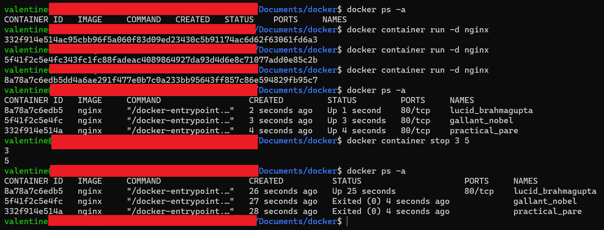

## 1.2
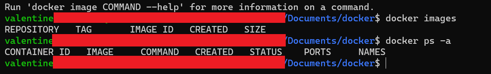

## 1.3
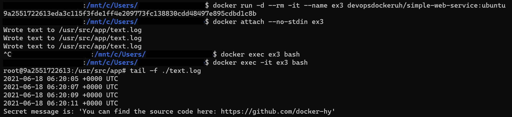

## 1.4
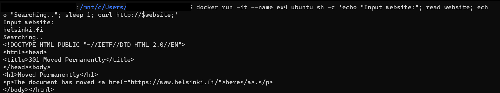

Before entering input values, open new tab and open bash inside container and install curl

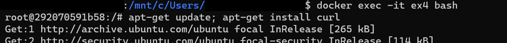

## 1.5
Size comaprison of two images

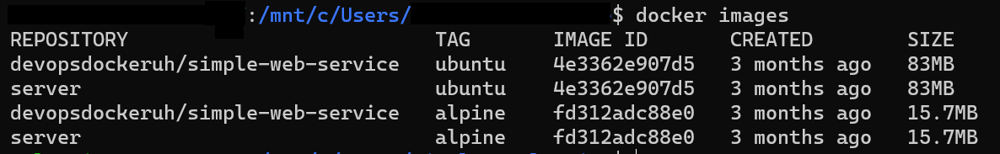

Ubuntu output

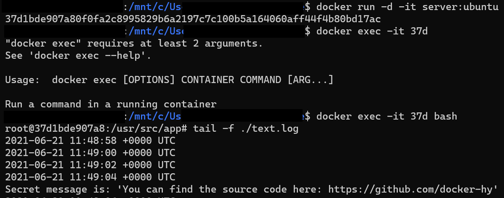

Alpine output

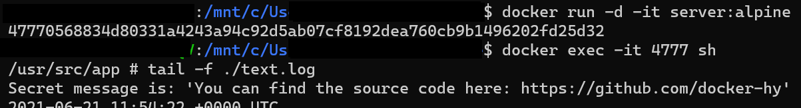

## 1.6

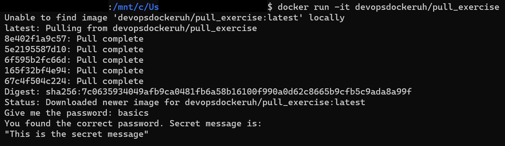

## 1.7
[Dockerfile](1.7/Dockerfile)

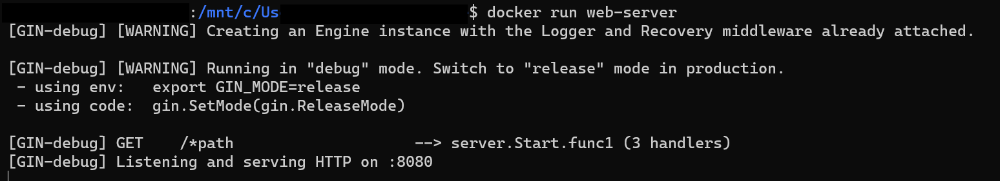

Commands
- `docker build . -t web-server`
- `docker run web-server`

## 1.8
[Dockerfile](1.8/Dockerfile)

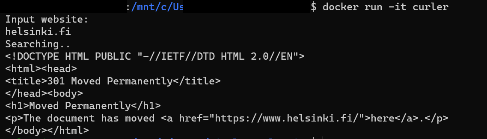

Commands
- `docker build . -t curler`
- `docker run -it curler`

## 1.9

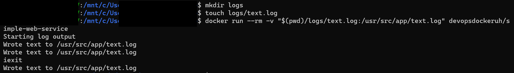

## 1.10

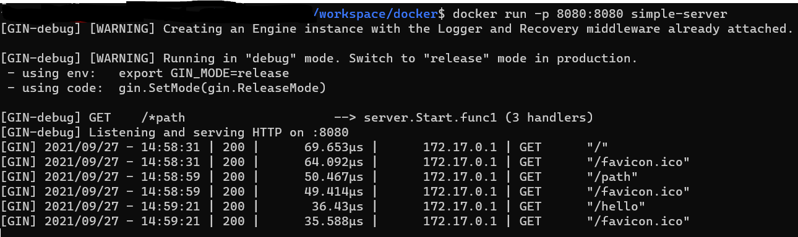

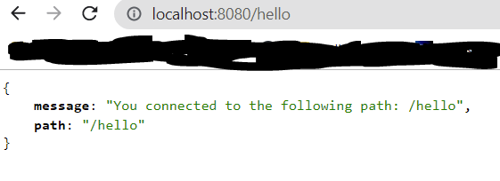

## 1.11

[Dockerfile](1.11/Dockerfile)

## 1.12

[Dockerfile](1.12/Dockerfile)

## 1.13

[Dockerfile](1.13/Dockerfile)

Build image with command `docker build . -t example-backend` in the same directory as [Dockerfile](1.13/Dockerfile).

Run container with command `docker run -p 8080:8080 example-backend`

## 1.14

## 1.15

## 1.16

